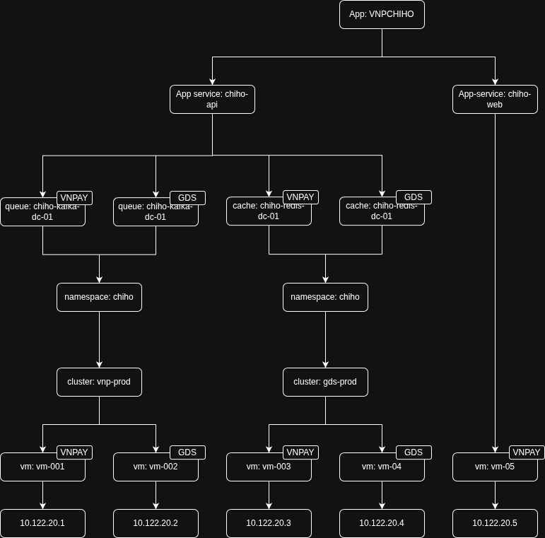

# Tài liệu Graph View - Biểu diễn quan hệ các Node trong Kiến trúc Hệ thống

## 1. Giới thiệu

Graph View là công cụ trực quan hóa dùng để biểu diễn quan hệ giữa các thành phần (node) trong một kiến trúc hệ thống. Graph giúp người dùng:

- **Hiểu rõ cấu trúc hệ thống**: Xem được toàn bộ các thành phần và cách chúng kết nối với nhau
- **Xác định vị trí triển khai**: Biết được node nào được triển khai trên site nào (VNPAY, GDS, v.v.)
- **Phân tầng kiến trúc**: Phân biệt các tầng Application, Middleware, Infrastructure, v.v.
- **Quản lý quan hệ**: Hiểu được các dependency và data flow giữa các components

### Đầu vào (Input)

Dữ liệu JSON chứa thông tin về:

- Danh sách các node (components trong hệ thống)
- Danh sách các edge (quan hệ giữa các node)
- Danh sách các layer (tầng kiến trúc)

### Đầu ra (Output)

Một đồ thị trực quan (graph visualization) hiển thị:

- Các node với icon, màu sắc phù hợp với loại CI
- Các edge thể hiện quan hệ giữa các node
- Thông tin về site triển khai (nếu có)
- Phân tầng theo layer

> 💡 **Xem hình minh họa**: Tham khảo [`mock.png`](./mock.png) để thấy ví dụ trực quan về graph visualization

## 2. Cấu trúc Dữ liệu Chi tiết

### 2.1. Node Type

Node đại diện cho một thành phần trong hệ thống (Application, Service, Database, Cache, v.v.)

**Cấu trúc JSON:**

```json
{
  "name": "string",
  "alias": "string",
  "layer": "string",
  "site": "string | null",
  "metadata": {},
  "ci_type": {
    "ci_name": "string",
    "ci_alias": "string",
    "ci_icon": "string",
    "ci_color": "string"
  }
}
```

**Mô tả các trường:**

| Trường             | Kiểu dữ liệu     | Bắt buộc | Mô tả                                                                                                                                                                       |
| ------------------ | ---------------- | -------- | --------------------------------------------------------------------------------------------------------------------------------------------------------------------------- |
| `name`             | `string`         | Có       | Tên hiển thị của node trên graph. Ví dụ: "VNPCHIHO", "CHIHO KAFKA DC01"                                                                                                     |
| `alias`            | `string`         | Có       | Định danh duy nhất của node trong graph. Dùng để tham chiếu trong edges. Ví dụ: "chiho", "chiho-kafka-dc-01". **Phải unique trong toàn bộ graph**                           |
| `layer`            | `string`         | Có       | Tầng kiến trúc mà node thuộc về. Giá trị: "Application", "Middleware", "System", "Infrastructure", "Network"                                                                |
| `site`             | `string \| null` | Có       | Vị trí triển khai của node.<br/>- `null`: Node không có triển khai vật lý (Application, Project level)<br/>- `"VNPAY"`, `"GDS"`, v.v.: Node được triển khai tại site cụ thể |
| `metadata`         | `object`         | Không    | Thông tin bổ sung tuỳ chỉnh theo nhu cầu. Ví dụ: `{"version": "1.0", "owner": "team-a"}`                                                                                    |
| `ci_type`          | `object`         | Có       | Thông tin về loại Configuration Item                                                                                                                                        |
| `ci_type.ci_name`  | `string`         | Có       | Tên loại CI. Ví dụ: "Application", "Queue", "Database", "Cache"                                                                                                             |
| `ci_type.ci_alias` | `string`         | Có       | Alias của loại CI. Ví dụ: "application", "queue", "database", "cache"                                                                                                       |
| `ci_type.ci_icon`  | `string`         | Có       | Tên icon dùng để hiển thị trên graph. Ví dụ: "caise-app", "caise-queue", "caise-database", "caise-cache"                                                                    |
| `ci_type.ci_color` | `string`         | Có       | Màu sắc đại diện cho loại CI (hex color). Ví dụ: "#000000", "#29AAE1"                                                                                                       |

**Ví dụ Node:**

```json
{
  "name": "VNPCHIHO",
  "alias": "chiho",
  "layer": "Application",
  "site": null,
  "metadata": {},
  "ci_type": {
    "ci_name": "Application",
    "ci_alias": "application",
    "ci_icon": "caise-app",
    "ci_color": "#000000"
  }
}
```

```json
{
  "name": "CHIHO KAFKA DC01",
  "alias": "chiho-kafka-dc-01",
  "layer": "Middleware",
  "site": "VNPAY",
  "metadata": {},
  "ci_type": {
    "ci_name": "Queue",
    "ci_alias": "queue",
    "ci_icon": "caise-queue",
    "ci_color": "#000000"
  }
}
```

### 2.2. Edge Type

Edge đại diện cho quan hệ/kết nối giữa hai node trong hệ thống.

**Cấu trúc JSON:**

```json
{
  "from": "string",
  "to": "string",
  "text": "string",
  "disableDefaultClickEffect": "boolean"
}
```

**Mô tả các trường:**

| Trường                      | Kiểu dữ liệu | Bắt buộc | Mô tả                                                                                        |
| --------------------------- | ------------ | -------- | -------------------------------------------------------------------------------------------- |
| `from`                      | `string`     | Có       | Alias của node nguồn (node bắt đầu của edge)                                                 |
| `to`                        | `string`     | Có       | Alias của node đích (node kết thúc của edge)                                                 |
| `text`                      | `string`     | Không    | Nhãn hiển thị trên edge, mô tả loại quan hệ. Ví dụ: "Data Center", "Replication", "API Call" |
| `disableDefaultClickEffect` | `boolean`    | Không    | Vô hiệu hoá hiệu ứng click mặc định. Mặc định: `false`                                       |

**Ví dụ Edge:**

```json
{
  "from": "chiho-api",
  "to": "chiho-kafka-dc-01",
  "text": "Publish Message",
  "disableDefaultClickEffect": false
}
```

```json
{
  "from": "mysql-db-primary",
  "to": "mysql-db-replica",
  "text": "Replication",
  "disableDefaultClickEffect": false
}
```

### 2.3. Layer

Layer định nghĩa các tầng kiến trúc trong hệ thống, giúp phân loại và tổ chức các node theo cấu trúc logic.

**Cấu trúc:** Mảng các string

```json
["Application", "Middleware", "System", "Infrastructure", "Network"]
```

**Mô tả các Layer:**

| Layer            | Mô tả                                                         | Ví dụ Node                                             |
| ---------------- | ------------------------------------------------------------- | ------------------------------------------------------ |
| `Application`    | Tầng ứng dụng nghiệp vụ, bao gồm các dự án, ứng dụng, service | Application, Application Service, Web App, API Service |
| `Middleware`     | Tầng middleware, các dịch vụ hỗ trợ cho application           | Database, Cache, Queue, Message Broker                 |
| `System`         | Tầng hệ thống                                                 | Operating System, Container Runtime                    |
| `Infrastructure` | Tầng hạ tầng vật lý và ảo hoá                                 | Virtual Machine, Physical Server, Storage              |
| `Network`        | Tầng mạng                                                     | Load Balancer, Router, Switch, Firewall                |

## 3. Cấu trúc JSON Đầu ra Hoàn chỉnh

Dữ liệu đầy đủ cho graph view bao gồm:

```json
{
  "node": [
    {
      "name": "VNPCHIHO",
      "alias": "chiho",
      "layer": "Application",
      "site": null,
      "metadata": {},
      "ci_type": {
        "ci_name": "Application",
        "ci_alias": "application",
        "ci_icon": "caise-app",
        "ci_color": "#000000"
      }
    },
    {
      "name": "CHIHO KAFKA DC01",
      "alias": "chiho-kafka-dc-01",
      "layer": "Middleware",
      "site": "VNPAY",
      "metadata": {},
      "ci_type": {
        "ci_name": "Queue",
        "ci_alias": "queue",
        "ci_icon": "caise-queue",
        "ci_color": "#000000"
      }
    }
  ],
  "edges": [
    {
      "from": "chiho",
      "to": "chiho-kafka-dc-01",
      "text": "Uses",
      "disableDefaultClickEffect": false
    }
  ],
  "layer": ["Application", "Middleware", "System", "Infrastructure", "Network"]
}
```

**Lưu ý về render:**

- Graph sẽ render các node theo layer từ trên xuống dưới hoặc từ trái sang phải tuỳ cấu hình
- Các edge sẽ được vẽ từ node `from` đến node `to`
- Icon và màu sắc của node được lấy từ `ci_type`
- Site information có thể được hiển thị dưới dạng badge hoặc label trên node

## 4. Quy tắc và Lưu ý

### 4.1. Quy tắc về Site Deployment

**Node có `site = null`:**

- Áp dụng cho các node ở mức logic/tổng quát
- Thường là: Application, Project, Application Service
- Không có triển khai vật lý cụ thể
- Đại diện cho khái niệm hoặc nhóm các component

**Node có `site` cụ thể (ví dụ: "VNPAY", "GDS"):**

- Áp dụng cho các node được triển khai thực tế tại một địa điểm
- Thường là: Database, Cache, Queue, Virtual Machine, Physical Server
- Có thể có nhiều instance của cùng một loại node tại các site khác nhau
- Ví dụ: `chiho-kafka-dc-01` tại VNPAY và `chiho-kafka-dr-01` tại GDS

### 4.2. Quy tắc về Alias

- **Alias phải unique** trong toàn bộ graph
- Không được trùng lặp giữa các node
- Nên sử dụng format: `<service>-<type>-<site>-<number>` cho các node có site
- Ví dụ: `chiho-kafka-dc-01`, `redis-cache-dr-02`

### 4.3. Quy tắc về Edge

- Edge chỉ có thể kết nối giữa các node đã tồn tại trong danh sách `node`
- Giá trị `from` và `to` phải trùng khớp với `alias` của node
- Một cặp node có thể có nhiều edge (ví dụ: bidirectional relationship)

### 4.4. Quy tắc về Layer

- Mỗi node phải thuộc về một layer
- Layer value phải nằm trong danh sách `layer` được định nghĩa
- Thứ tự layer thường được sắp xếp từ tầng cao (Application) đến tầng thấp (Network)

## 5. Ví dụ Thực tế

Tham khảo file [`mock.json`](./mock.json) để xem ví dụ đầy đủ về một graph thực tế.

### 5.0. Visualization Example

Hình ảnh dưới đây minh họa cách graph được render từ dữ liệu trong [`mock.json`](./mock.json):



Graph này thể hiện:

- **4 tầng kiến trúc**: Application → Middleware → System → Infrastructure
- **Multi-site deployment**: VNPAY (DC) và GDS (DR)
- **Các mối quan hệ**: Từ application xuống các VM và IP addresses
- **Site badges**: Hiển thị rõ ràng node nào thuộc site nào

**Cấu trúc trong hình:**

1. **Application Layer (Tầng 1):**

   - App: VNPCHIHO (root application)
   - App service: chiho-api, chiho-web (services)

2. **Middleware Layer (Tầng 2):**

   - queue: chiho-kafka-dc-01 (VNPAY), chiho-kafka-dc-01 (GDS)
   - cache: chiho-redis-dc-01 (VNPAY), chiho-redis-dc-01 (GDS)

3. **System Layer (Tầng 3):**

   - namespace: chiho (VNPAY), chiho (GDS)
   - cluster: vnp-prod (VNPAY), gds-prod (GDS)
   - vm: vm-001, vm-002, vm-003, vm-004, vm-005

4. **Infrastructure Layer (Tầng 4):**
   - IP addresses: 10.122.20.1, 10.122.20.2, 10.122.20.3, 10.122.20.4, 10.122.20.5

### 5.1. Ví dụ về Application Node (không có site)

Node `VNPCHIHO` đại diện cho một ứng dụng tổng thể, không có site deployment cụ thể:

```json
{
  "name": "VNPCHIHO",
  "alias": "chiho",
  "layer": "Application",
  "site": null,
  "metadata": {},
  "ci_type": {
    "ci_name": "Application",
    "ci_alias": "application",
    "ci_icon": "caise-app",
    "ci_color": "#000000"
  }
}
```

### 5.2. Ví dụ về Middleware Nodes (có site deployment)

**Kafka tại VNPAY:**

```json
{
  "name": "CHIHO KAFKA DC01",
  "alias": "chiho-kafka-dc-01",
  "layer": "Middleware",
  "site": "VNPAY",
  "metadata": {},
  "ci_type": {
    "ci_name": "Queue",
    "ci_alias": "queue",
    "ci_icon": "caise-queue",
    "ci_color": "#000000"
  }
}
```

**Kafka tại GDS:**

```json
{
  "name": "CHIHO KAFKA DR01",
  "alias": "chiho-kafka-dr-01",
  "layer": "Middleware",
  "site": "GDS",
  "metadata": {},
  "ci_type": {
    "ci_name": "Queue",
    "ci_alias": "queue",
    "ci_icon": "caise-queue",
    "ci_color": "#000000"
  }
}
```

### 5.3. Ví dụ về Multi-site Deployment

Trong file `mock.json`, bạn có thể thấy pattern triển khai multi-site:

- **DC (Data Center - VNPAY)**: `chiho-kafka-dc-01`, `chiho-kafka-dc-02`, `chiho-kafka-dc-03`
- **DR (Disaster Recovery - GDS)**: `chiho-kafka-dr-01`, `chiho-kafka-dr-02`, `chiho-kafka-dr-03`

Pattern này giúp:

- Đảm bảo high availability
- Disaster recovery
- Load balancing giữa các site

### 5.4. Ví dụ về Database Replication

```json
{
  "edges": [
    {
      "from": "mysql-db-primary",
      "to": "mysql-db-replica",
      "text": "Replication",
      "disableDefaultClickEffect": false
    }
  ]
}
```

Trong đó:

- `mysql-db-primary` có `site = "VNPAY"` (Primary database)
- `mysql-db-replica` có `site = "GDS"` (Replica database cho DR)

## 6. Use Cases Thường gặp

### 6.1. Tạo Graph cho một Application mới

1. Tạo node Application (site = null)
2. Tạo các node Service thuộc Application (site = null hoặc có site tuỳ yêu cầu)
3. Tạo các node Middleware mà Service sử dụng (có site)
4. Tạo các edge thể hiện quan hệ

### 6.2. Thêm Multi-site cho Component

1. Tạo nhiều node cùng loại với alias khác nhau
2. Gán site khác nhau cho mỗi node
3. Tạo edge replication/sync giữa các node nếu cần

### 6.3. Hiển thị Data Flow

1. Tạo edge từ nguồn đến đích
2. Sử dụng trường `text` để mô tả loại data flow
3. Có thể tạo nhiều edge để thể hiện bidirectional flow

## 7. Best Practices

1. **Đặt tên alias rõ ràng**: Sử dụng convention nhất quán, dễ nhận biết
2. **Sử dụng metadata**: Lưu thông tin bổ sung hữu ích vào metadata
3. **Phân tầng hợp lý**: Đảm bảo node được phân đúng layer
4. **Site deployment**: Luôn xác định rõ node nào cần site, node nào không
5. **Edge text có ý nghĩa**: Mô tả rõ ràng loại quan hệ giữa các node
6. **Icon và màu sắc nhất quán**: Cùng loại CI nên có cùng icon và màu

## 8. Tham khảo

- **File mẫu dữ liệu**: [`mock.json`](./mock.json) - Dữ liệu JSON mẫu cho graph
- **Hình ảnh minh họa**: [`mock.png`](./mock.png) - Visualization example của graph
- **Topology view implementation**: `cmdb-ui/src/modules/cmdb/views/topology_view/` - Code implementation
