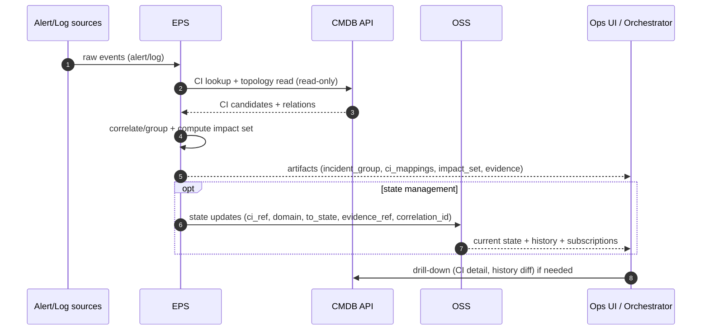
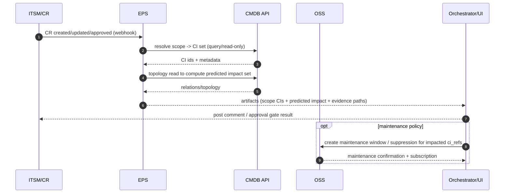

# Technical Design Document (TDD)
## Use cases: Incident/RCA & Change Impact Analysis trên CMDB + ecosystem

**Version:** 1.0 (Draft)  
**Date:** 2026-01-27  
**Owner:** Platform / SRE / Ops Engineering  
**Scope:** Thiết kế kỹ thuật theo **CMDB hiện tại trong repo này** (cmdb-api + cmdb-ui), tập trung 2 use case:

- **Use case 1**: Tìm lỗi, **root cause** và các **CI ảnh hưởng** (blast radius)  
- **Use case 2**: **Change Request** đánh giá xem có thể ảnh hưởng đến những **CI nào**

---

## Table of Contents

1. [Executive Summary](#executive-summary)  
2. [Goals & Non-goals](#goals--non-goals)  
3. [Actors & Systems](#actors--systems)  
4. [CMDB capabilities leveraged (as-is)](#cmdb-capabilities-leveraged-as-is)  
5. [Data flow (end-to-end)](#data-flow-end-to-end)  
6. [Tích hợp EPS & OSS (theo TDD ecosystem)](#tích-hợp-eps--oss-theo-tdd-ecosystem)  
7. [Domain model & assumptions](#domain-model--assumptions)  
8. [Use case 1 — Incident → RCA + impacted CIs](#use-case-1--incident--rca--impacted-cis)  
9. [Use case 2 — Change Request → Impact Analysis](#use-case-2--change-request--impact-analysis)  
10. [API contracts (CMDB)](#api-contracts-cmdb)  
11. [Impact traversal algorithm (directional)](#impact-traversal-algorithm-directional)  
12. [UI/UX additions (cmdb-ui)](#uiux-additions-cmdb-ui)  
13. [Security, Permissions, Audit](#security-permissions-audit)  
14. [Performance & Scalability](#performance--scalability)  
15. [Testing Strategy](#testing-strategy)  
16. [Phased Rollout](#phased-rollout)  
17. [Open Questions](#open-questions)

---

## Executive Summary

CMDB trong repo này đã có:

- **CI search/detail** (`/api/v0.1/ci/s`, `/api/v0.1/ci/<id>`)
- **Relationship topology query** (`/api/v0.1/ci_relations/s`, `/api/v0.1/ci_relations/path/s`, graph endpoints)
- **Audit/history** cho thay đổi attributes và relations (`/api/v0.1/history/...`)
- **RelationType** có 2 flags quan trọng để “propagate impact” theo hướng:
  - `first_ci_to_second_ci_impact`
  - `second_ci_to_first_ci_impact`

TDD này chuẩn hoá 2 workflow (Incident/RCA & Change Impact) dựa trên **topology + direction impact flags + history evidence**, đồng thời mô tả cách tích hợp ecosystem (Monitoring/Logs, ITSM/CR, EPS nếu có) theo mô hình “CMDB là system-of-record, các hệ thống khác cung cấp signal/ticket”.

---

## Goals & Non-goals

### Goals

- Xác định nhanh **CI trực tiếp lỗi** và mở rộng ra **impact set** (blast radius) theo topology.
- Tạo **RCA candidate list** + bằng chứng (evidence) dựa trên:
  - topology paths,
  - thời điểm xuất hiện signal,
  - lịch sử thay đổi CI/relation gần thời điểm incident.
- Cho Change Request: từ scope (CI list / query / service) → tính **impact set dự kiến**, phục vụ phê duyệt/plan test/notify.
- Bảo toàn ràng buộc permission/ACL và audit.

### Non-goals

- Không xây mới event processing engine trong CMDB (nếu cần, tham chiếu `docs/TDD_Event_Processing_System.md`).
- Không thay thế monitoring/log platform hoặc ITSM.
- Không tự động “set state/health” cho CI trong CMDB (CMDB ở đây chủ yếu là configuration + topology + audit).

---

## Actors & Systems

### Actors

- **NOC/SRE**: triage incident, tìm blast radius, root cause candidate.
- **Change manager / Release manager**: đánh giá impact trước khi approve CR.
- **App owner / Infra owner**: xác nhận CI ownership/criticality.

### Systems in ecosystem

- **CMDB** (this repo): system-of-record cho CI types/CI attributes/relations/history.
- **Monitoring/Alerting**: Alertmanager/Zabbix/… (external).
- **Log platform**: ELK/Loki/Splunk/… (external).
- **ITSM/Change system**: ServiceNow/Jira/… (external).
- **EPS (optional)**: ingest/correlate signals và gọi CMDB để impact (tham chiếu TDD EPS).

---

## CMDB capabilities leveraged (as-is)

### 1) Topology & traversal

- **CI relations storage**: `c_ci_relations (first_ci_id, second_ci_id, relation_type_id)`
- **CI type relations**: `c_ci_type_relations (parent_id, child_id, relation_type_id, constraint, matching_rules, ...)`
- **Directional impact flags**: `c_relation_types (first_ci_to_second_ci_impact, second_ci_to_first_ci_impact)`

### 2) Query APIs (đã có)

- **Search CI**: `GET /api/v0.1/ci/s?q=...`
- **CI detail**: `GET /api/v0.1/ci/<ci_id>`
- **Search relations/topology**: `GET /api/v0.1/ci_relations/s?root_id=<ci_id>&level=1&...`
  - Có `reverse` và logic lấy cả **children** và **parents** (direct) trong implementation hiện tại.
- **Path query**: `POST /api/v0.1/ci_relations/path/s` (tìm paths theo CIType path)
- **History**:
  - `GET /api/v0.1/history/ci/<ci_id>`
  - `GET /api/v0.1/history/records/attribute?...`
  - `GET /api/v0.1/history/records/relation?...`

### 3) Matching rules cho auto-build relations (nếu dùng)

CMDB hỗ trợ `matching_rules` trên `CITypeRelation` để tự động match relations dựa trên attributes (xem `cmdb-api/docs/matching_rules.md`).

---

## Data flow (end-to-end)

### Use case 1 — Incident/RCA: signal → CI correlation → impact → RCA evidence

```mermaid
flowchart LR
  subgraph EXT[External systems]
    MON[Monitoring/Alerting]
    LOG[Log platform]
    ITSM[ITSM / Incident Ticket]
  end

  subgraph EPS[EPS / Correlation layer (optional)]
    PARSE[Normalize + parse hints\n(host/ip/service/instance)]
    MAP[CI correlation\n(hint -> ci_id candidates)]
    IMP[Impact analysis\n(direction + depth + boundary)]
    RCA[RCA candidate ranking\n(+ change proximity)]
    ART[Artifacts\n(impact set + evidence)]
  end

  subgraph CMDB[CMDB (this repo)]
    CIS[CI Search\nGET /api/v0.1/ci/s]
    CID[CI Detail\nGET /api/v0.1/ci/{id}]
    REL[Topology query\nGET /api/v0.1/ci_relations/s\nPOST /ci_relations/filtered_graph]
    HIST[History/Audit\nGET /api/v0.1/history/*]
    RT[(RelationType impact flags\nfirst->second / second->first)]
  end

  subgraph OPS[Ops users]
    NOC[NOC/SRE UI]
  end

  MON --> PARSE
  LOG --> PARSE
  ITSM --> PARSE

  PARSE --> MAP
  MAP --> CIS
  CIS --> MAP
  MAP --> CID
  CID --> MAP

  MAP --> IMP
  IMP --> REL
  REL --> IMP
  RT --> IMP

  IMP --> RCA
  RCA --> HIST
  HIST --> RCA

  RCA --> ART
  ART --> NOC
  NOC --> ITSM
```

### Use case 2 — Change Impact: CR → scope resolution → impact preview → approval/notify

```mermaid
flowchart LR
  subgraph EXT[External systems]
    ITSM[ITSM / Change Request]
    CHAT[Chat/Email (notify)]
  end

  subgraph UI[CMDB UI / Portal]
    FORM[CR scope input\n(CI list / query / service scope)]
    PREVIEW[Impact preview\n(summary + drilldown)]
    EXPORT[Export to CR comment\n(markdown evidence)]
  end

  subgraph CMDB[CMDB (this repo)]
    CIS[CI Search\nGET /api/v0.1/ci/s]
    CID[CI Detail\nGET /api/v0.1/ci/{id}]
    REL[Topology query\nGET /api/v0.1/ci_relations/s\nPOST /ci_relations/filtered_graph]
    HIST[History/Audit (optional)\nGET /api/v0.1/history/*]
    RT[(RelationType impact flags)]
  end

  ITSM --> FORM
  FORM --> CIS
  CIS --> FORM
  FORM --> CID
  CID --> FORM

  FORM --> PREVIEW
  PREVIEW --> REL
  REL --> PREVIEW
  RT --> PREVIEW
  HIST --> PREVIEW

  PREVIEW --> EXPORT
  EXPORT --> ITSM
  PREVIEW --> CHAT
```

### Draw.io XML (offline diagram assets)

- Data flow:
  - `docs/diagrams/incident_eps_cmdb_oss_dataflow.drawio.xml`
  - `docs/diagrams/change_eps_cmdb_oss_dataflow.drawio.xml`
- Sequence:
  - `docs/diagrams/incident_eps_cmdb_oss_sequence.drawio.xml`
  - `docs/diagrams/change_eps_cmdb_oss_sequence.drawio.xml`

---

## Tích hợp EPS & OSS (theo TDD ecosystem)

Tham chiếu 2 tài liệu nền:

- EPS: `docs/TDD_Event_Processing_System.md`
- OSS: `docs/TDD_CI_Operational_State_Service.md`

### Boundary (tách trách nhiệm)

- **CMDB**: system-of-record cho `CI/CIType/attributes/relations/topology/history (change audit)`.
- **EPS**: ingest raw signals (alert/log/CR), correlate/group, **map CI + tính impact set**, xuất artifacts.
- **OSS**: system-of-record cho **operational state timeline** (current + history + notify), **không xử lý raw events**.

### Tích hợp cho Use case 1 (Incident/RCA)

Có 2 chế độ triển khai (khuyến nghị bắt đầu từ nhẹ → nặng):

- **Mode A — CMDB-only (manual)**:
  - Operator paste signal → UI query CMDB để map CI + blast radius + history (đã mô tả trong Use case 1).
- **Mode B — EPS + (optional) OSS**:
  - EPS ingest signal → tạo `incident_group` + `ci_mappings` + `impact_set` (dựa CMDB read-only).
  - (Tuỳ tổ chức) EPS tạo thêm **state update** gửi sang OSS để downstream có “current state” ổn định.

**Luồng dữ liệu (EPS + OSS)**:



### Tích hợp cho Use case 2 (Change Request → Impact Analysis)

Khuyến nghị:

- EPS ingest CR lifecycle (create/approve/start/end) → resolve scope → compute predicted impact set (CMDB read-only)
- UI/Orchestrator dùng artifacts để:
  - comment vào CR (impact summary + evidence)
  - (tuỳ policy) set **maintenance/suppression** trên OSS trong change window cho CI impacted



### Contract tối thiểu giữa EPS/OSS và CMDB

#### 1) CI identifier chuẩn (`ci_ref`)

- Dùng format string: **`cmdb:<ci_id>`** (phù hợp cả EPS và OSS TDD).

#### 2) Correlation & idempotency (khuyến nghị)

- **`request_id` / `correlation_id`**: đi xuyên suốt từ nguồn → EPS → OSS/Orchestrator để trace/audit.
- **Idempotency**:
  - EPS artifacts: `normalized_event_id` + `incident_group_id` ổn định theo fingerprint + time-bucket (EPS TDD).
  - OSS state update: có `update_id` hoặc `Idempotency-Key` để at-least-once delivery.

#### 3) Evidence refs

- EPS artifacts và OSS state history nên giữ `evidence_ref` trỏ về alert/log/ticket/CR (URL/ID), và snapshot tối thiểu để debug.

### UI: dùng OSS như thế nào?

- **Dashboard “Current state”** nên query từ **OSS** (vì OSS là state store có TTL/override/maintenance/history).
- Khi cần topology/explainability/ownership/attributes: UI gọi **CMDB** (system-of-record).
- Khi cần “tại sao state đổi”: UI lấy history từ **OSS** (state history + evidence_ref), và drill-down sang EPS/Log/ITSM nếu cần.

---

## Domain model & assumptions

### Topology semantics

- Một relation instance nối **(first_ci → second_ci)** và có `relation_type_id`.
- Việc “impact propagate” nên dựa trên **RelationType directional flags**:
  - Nếu `first_ci_to_second_ci_impact=1`: failure/change của `first_ci` có thể impact `second_ci`
  - Nếu `second_ci_to_first_ci_impact=1`: failure/change của `second_ci` có thể impact `first_ci`

> Lưu ý: CMDB cho phép nhiều relation types; semantics cụ thể do tổ chức định nghĩa (ví dụ `hosted_on`, `depends_on`, `connected_to`). TDD này không hardcode semantics theo tên; ưu tiên dùng 2 impact flags để “chuẩn hoá direction”.

### Boundary rules (khuyến nghị)

Để blast radius thực dụng và không “nổ tung”:

- Giới hạn `max_depth` (ví dụ 2–4).
- Stop conditions theo:
  - environment (prod/staging),
  - tenant/org,
  - service boundary,
  - CIType allowlist/denylist.

---

## Use case 1 — Incident → RCA + impacted CIs

### Input

Incident signal có thể đến từ:

- Alert: metric alert (CPU, latency, endpoint down) + labels (service, instance, cluster, ip)
- Log error: error signature + host/container
- Ticket: incident id + các field “affected service/CI/hostname”

### Output

- **Directly affected CI candidates** (confidence + evidence)
- **Impact set** (list CI impacted + paths + relation types)
- **Root cause candidates** (ranked) + supporting evidence:
  - earliest signals,
  - topology coverage,
  - recent changes (history) gần incident time.

### Workflow (high-level)

```text
Signal/Incident
  -> CI Correlation (map hint -> CI)
  -> Blast radius (directional graph traversal)
  -> RCA candidate ranking (symptoms + topology + change history)
  -> Report/Attach to incident ticket
```

### Step 1 — Map signal → candidate CI(s)

Chiến lược mapping theo thứ tự ưu tiên:

1. **Direct CI id** (nếu signal/ticket đã chứa `ci_id`)
   - `GET /api/v0.1/ci/<ci_id>`
2. **Unique attribute lookup** (hostname, ip, instance_id…)
   - `GET /api/v0.1/ci/s?q=_type:(<type_ids>) AND <attr_name>:<value>`
3. **Service scope** (service/env/team)
   - Query bằng attribute/service tag nếu có trong data model
4. Nếu mơ hồ: trả về top N candidates + cần xác nhận thủ công (UI)

**Evidence** cho mỗi mapping: `(source_ref, matched_attr, query, matched_ci_id)`.

### Step 2 — Compute blast radius (impact set)

Từ mỗi `direct_ci_id`, compute impact set bằng traversal theo impact flags (chi tiết ở mục [Impact traversal algorithm](#impact-traversal-algorithm-directional)).

API trợ giúp hiển thị nhanh topology quanh root:

- `GET /api/v0.1/ci_relations/s?root_id=<ci_id>&level=1&count=...`
- (tuỳ chọn) `POST /api/v0.1/ci_relations/<root_ci_id>/filtered_graph` để apply filter theo CIType + attribute values.

### Step 3 — Root cause ranking

Root cause thường là CI “upstream” tạo ra nhiều symptoms downstream. TDD khuyến nghị scoring:

- **Signal score**: CI có signal “hard failure” (down, unreachable, error spike) → điểm cao.
- **Coverage score**: số lượng CI impacted downstream (theo directional traversal) → điểm cao.
- **Timing score**: signal xuất hiện sớm nhất trong incident window → điểm cao.
- **Change proximity score**: CI có thay đổi gần thời điểm incident (deploy/config/relationship change) → điểm cao.

**Evidence từ history (CMDB):**

- `GET /api/v0.1/history/ci/<ci_id>`: timeline attribute changes
- `GET /api/v0.1/history/records/attribute?ci_id=<ci_id>&start=<t0>&end=<t1>`
- `GET /api/v0.1/history/records/relation?first_ci_id=<id>...` hoặc `second_ci_id=<id>...`

> Nếu ITSM có `ticket_id/change_id`, khuyến nghị ghi vào `OperationRecord.ticket_id` khi thay đổi CI/relation (CMDB đã có field này trong history model).

### Sequence (tối giản)

```text
NOC/SRE -> Monitoring/Logs: nhận alert/log
NOC/SRE -> CMDB: search CI theo hint
CMDB -> NOC/SRE: CI candidates
NOC/SRE -> CMDB: query topology + impact set
CMDB -> NOC/SRE: impacted CIs + paths
NOC/SRE -> CMDB: query history gần incident
CMDB -> NOC/SRE: change evidence
NOC/SRE: kết luận RCA candidate + attach ticket
```

---

## Use case 2 — Change Request → Impact Analysis

### Input

Change Request (CR) tối thiểu cần:

- `cr_id`
- `change_window` (start/end)
- `scope` dưới một trong các dạng:
  - **explicit CI list**: `[ci_id, ...]`
  - **selector/query**: type + query expression (ví dụ theo service/env)
  - **service scope**: service_id/service_name → map sang CI bằng attribute/tag/relations
- `change_type` (deploy/config/network/maintenance/...)

### Output

- **Change scope CIs** (direct targets)
- **Predicted impact set** (CIs có thể bị ảnh hưởng)
- **Impact summary**: theo CIType, criticality/owner (nếu có attribute), environment boundary
- **Recommended pre-check / post-check** list

### Workflow (high-level)

```text
CR created/updated
  -> Resolve scope to CIs (CI search)
  -> Impact traversal (directional + policy)
  -> Summarize + approval gates
  -> Notify owners / attach to CR
```

### Step 1 — Resolve CR scope → direct target CIs

- Nếu CR có CI IDs: validate tồn tại bằng `GET /api/v0.1/ci/<id>`
- Nếu CR có query:
  - `GET /api/v0.1/ci/s?q=<expr>&count=...`
- Nếu CR có “service scope”:
  - query theo attributes (service_name/team/env) hoặc traverse từ Service CI → children/parents.

### Step 2 — Impact traversal policy (khuyến nghị)

Impact policy phụ thuộc `change_type`:

- **Deploy/config on an app/service CI**:
  - propagate theo impact direction (impact flags) và thường “downstream” (consumer/business service)
- **Network/infra change**:
  - propagate có thể rộng hơn (cả upstream/downstream) nhưng vẫn dựa impact flags; tăng `max_depth`
- **Maintenance on host**:
  - propagate host → hosted components (downstream)

Mặc định TDD dùng impact flags để quyết định direction, và override bằng policy theo change_type nếu cần.

### Step 3 — Approval gates (example)

- Nếu `|impact_set|` > threshold hoặc có CI thuộc “critical tier” → require extra approval.
- Nếu impact vượt boundary (prod, cross-team) → require CAB.

### Step 4 — Pre-check/Post-check suggestions (derived)

Từ impact set, generate checklist:

- **Pre-check**: open incidents on impacted CIs; recent changes (history); dependency health snapshot.
- **Post-check**: verify key SLI/SLO for impacted services; smoke tests; topology unchanged unless expected.

---

## API contracts (CMDB)

### CI

- `GET /api/v0.1/ci/s`
  - **params**: `q`, `page`, `count|page_size`, `fl`, `sort`, `facet`, ...
- `GET /api/v0.1/ci/<ci_id>`

### Topology / relations

- `GET /api/v0.1/ci_relations/s`
  - **params**: `root_id`, `level` (list or scalar), `reverse` (bool), `q` (optional), `descendant_ids` (optional)
  - Use-case: lấy neighborhood/graph theo level phục vụ UI + coarse impact.
- `POST /api/v0.1/ci_relations/path/s`
  - Use-case: hiển thị paths theo CIType path (đặc biệt khi cần giải thích blast radius).
- `POST /api/v0.1/ci_relations/<root_ci_id>/filtered_graph`
  - Use-case: giới hạn graph theo CIType + attribute filter (boundary rule).

### History / audit

- `GET /api/v0.1/history/ci/<ci_id>`
- `GET /api/v0.1/history/records/attribute`
- `GET /api/v0.1/history/records/relation`

---

## Impact traversal algorithm (directional)

### Inputs

- `root_ci_ids`: list CI trực tiếp bị ảnh hưởng (từ incident hoặc change scope)
- `max_depth`: depth limit
- `boundary_filter`: env/team/service/type allowlist/denylist
- `relation_type_policy`: sử dụng `first_ci_to_second_ci_impact` / `second_ci_to_first_ci_impact`

### Core idea

Build directed edges từ mỗi relation instance:

- edge `first -> second` nếu `first_ci_to_second_ci_impact=1`
- edge `second -> first` nếu `second_ci_to_first_ci_impact=1`

Sau đó BFS/DFS từ root trên directed graph để lấy `impact_set`.

### Notes (implementation options)

- **Option A (API-only)**: lấy graph lân cận bằng `/ci_relations/s` hoặc `/filtered_graph`, rồi traversal client-side.
- **Option B (server-side)**: bổ sung endpoint chuyên `GET /impact?root_ci_id=...` (không nằm trong scope TDD này, nhưng là hướng mở).

---

## UI/UX additions (cmdb-ui)

### Incident/RCA view (recommend)

- Form “Paste alert/log/ticket” → parse hints → show CI candidates.
- “Impact preview”:
  - impacted CI list (group by type)
  - topology explanation: show path(s) + relation type
- “RCA candidates” tab:
  - ranked list + links tới CI detail + history diff gần incident time.

### Change Impact view (recommend)

- CR input: CI list / query builder / service selection
- Impact summary + approval hints
- Export to ticket comment (markdown) kèm:
  - direct scope,
  - impact set,
  - pre/post checklist,
  - evidence paths.

---

## Security, Permissions, Audit

- Tất cả query CI và relation phải chịu **ACL/CI filter permissions** như hiện có.
- Khi dùng output để attach ticket/CR, không leak CI mà user không có quyền read.
- History endpoints yêu cầu quyền audit/operation tương ứng (đã có decorators trong codebase).

---

## Performance & Scalability

- Luôn giới hạn `max_depth` và áp dụng boundary filters.
- Với graph lớn: ưu tiên trả “summary by type” (như `stats_by_type`) trước, rồi drill-down.
- Cache: CMDB đã có Redis cache cho CI và relations; traversal nên tận dụng cache khi có.

---

## Testing Strategy

### Dataset/fixtures (tối thiểu)

- Topology có ít nhất 3 tầng (infra → platform → app → business).
- Có vòng lặp relation (để test visited set).
- Có many-to-many relation (để test search/graph behavior).
- RelationType có đủ 3 nhóm:
  - one-way impact (A->B),
  - reverse impact (B->A),
  - bidirectional impact.

### Test cases

- **Incident mapping**:
  - direct CI id
  - hostname/ip lookup
  - ambiguous match (multiple candidates)
- **Blast radius**:
  - depth limit
  - boundary filter works
  - direction flags respected
- **RCA ranking**:
  - root cause upstream vs downstream
  - recent changes near incident time pulls correct history records
- **Change impact**:
  - scope by CI list
  - scope by query
  - approval threshold triggers

---

## Phased Rollout

1. **Phase 0**: UI “Impact preview” cho 1 CI (manual input), depth=1..2.
2. **Phase 1**: Incident helper: mapping hint → CI + impact set + history panel.
3. **Phase 2**: Change impact: scope resolution + impact preview + export comment.
4. **Phase 3**: Ecosystem integration: EPS/ITSM connectors tự động gọi CMDB để impact.

---

## Open Questions

1. Tổ chức đang chuẩn hoá relation types nào và set impact flags ra sao? (đây là chìa khoá để directional impact đúng)
2. Boundary attributes chuẩn là gì? (env/service/team/region/tenant…)
3. Criticality/owner có đang là attributes trong CMDB không? (để approval gates tốt hơn)
4. Change Request input format cụ thể (ServiceNow/Jira fields) để map sang CI query?
5. Depth tối đa mong muốn cho prod (2, 3 hay 4)?


